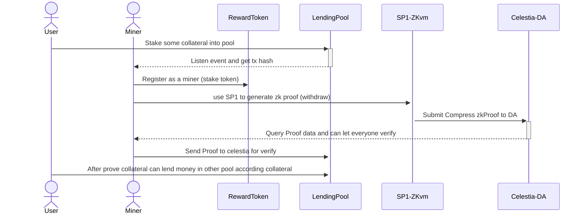

<div align="center">
<h1>Goten</h1>
<p>A future proof generate reward system. Goten is a Data Availability (DA) layer-based on-chain transaction executor focused on enhancing Layer 2 interoperability.</p>

</img>

[](./LICENSE)
[](https://docs-goten.pages.dev)
</div>

### Demo Page
- Website: [https://goten.pages.dev](https://goten.pages.dev)
- Docs: [https://docs-goten.pages.dev](https://docs-goten.pages.dev)
- Deck: [Canva](https://www.canva.com/design/DAGFUPMX0E8/ZQbHode-DwiUIMzt5DP3NQ/)
- Contract:
  + Sepolia Token: [0xceD74eB93fc5c0c6993a811F989779dD4FE27967](https://sepolia.etherscan.io/address/0xceD74eB93fc5c0c6993a811F989779dD4FE27967#code)
  + Sepolia Miner: [0x4c85F47D01668349FCb1653EaFE901dd7324e45b](https://sepolia.etherscan.io/address/0x4c85F47D01668349FCb1653EaFE901dd7324e45b#code)

### Abstract
Goten is a Data Availability (DA) layer-based on-chain transaction executor focused on enhancing Layer 2 interoperability. By leveraging zk-proof systems, Goten ensures system security and transaction reliability, thereby improving the user experience across multiple chains.

Users can quickly withdraw from various Layer 2 chains and perform cross-chain transactions using our service, leveraging deep liquidity pools to ensure high-security on-chain fund transfers.

Validators, also known as miners, help users submit transactions on the platform, earning transaction fees and project tokens. They send pre- and post-proof data to the DA layer. To promote a decentralized system, Layer 1 token rewards are distributed on Layer 2, encouraging validators to participate as miners.

### Goten Components

Goten consists of three main components:

1. **Goten Reward Token**:
   Goten’s flagship product is a unique token deployed on Layer 1 (Ethereum). This token can be cross-chained or deposited into the Layer 2 system. It is obtained exclusively through executing zk proofs. Token distribution across different chains is balanced during operational periods to maintain deposit levels.

2. **Goten Prover (Miner)**:
   Goten provers implement proofs on various chains, publish proofs to the DA layer, and use contracts for action proofs. Currently, Groth16 is used to enable Solidity to read zk proofs, allowing zkVM transaction proofs to be verified on-chain. Provers can also execute on-chain actions.

3. **Goten Liquidity Pool**:
   This is the practical application of Goten, enabling multi-chain lending and decentralized exchanges. Users can deposit into this pool and utilize the composability of contracts to facilitate multi-asset interoperability across chains.

### Build & Installation
| Goten is a monorepo managed using `turbo`. You can find the source code for each package in the `apps` and `packages` directory.
- apps`
  + `apps/web` is the web frontend. It built by frontend template, `wagmi` and `vite`
- `packages`
  + `packages/contract` 

### Step By Step
1. Install all peer dependencies
```bash
pnpm install
```

2. Build only frontend
```bash
pnpm build --filter web
```

3. Deploy Contract
```bash
cd packages/contract
pnpm deploy:token --networks <YOUR_NETWORK>
pnpm deploy:miner --networks <YOUR_NETWORK>
```

### Sequence Diagram

| Use case: Liquidity Pool as lending protocol



