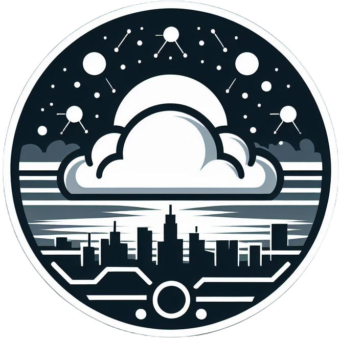

<div align="center">
<h1>Goten</h1>
<p>A future proof generate reward system</p>
</img>

[](./LICENSE)
</div>

### Demo Page

### Abstract
   
### Build & Installation
| Goten is a monorepo managed using `turbo`. You can find the source code for each package in the `apps` and `packages` directory.
- apps`
  + `apps/web` is the web frontend. It built by frontend template, `wagmi` and `vite`
- `packages`
  + `packages/contract` 

### Step By Step
1. Install all peer dependencies
```bash
pnpm install
```

2. Build only frontend
```bash
pnpm build --filter web
```

3. Deploy Contract
```bash
cd packages/contract
pnpm deploy:token --networks <YOUR_NETWORK>
pnpm deploy:miner --networks <YOUR_NETWORK>
```

### Sequence Diagram


